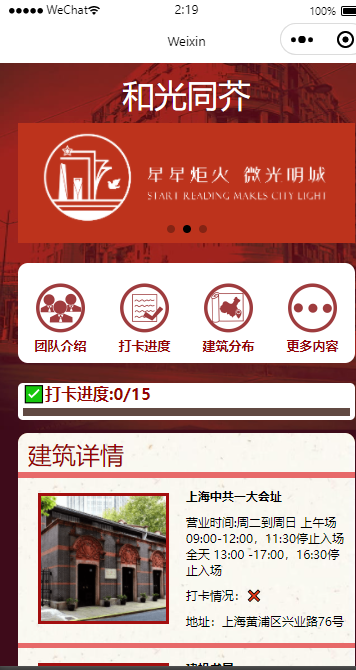
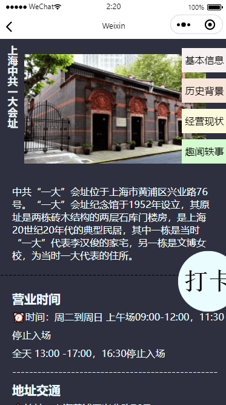
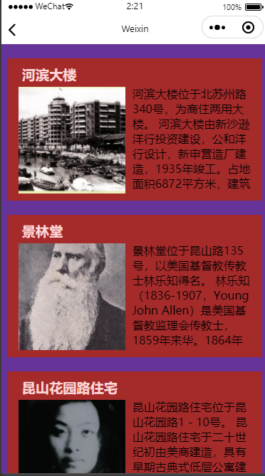
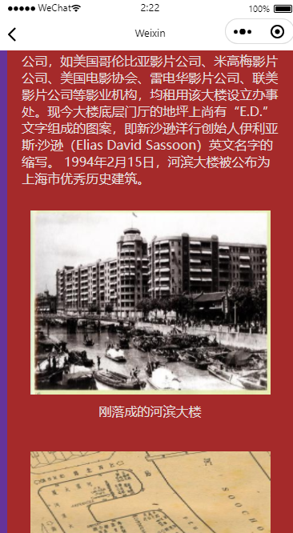

# RedBuiding_minprogram
### 上海红色建筑打卡小程序

上微信小程序搜索**星炬火**
后端框架为python fastapi（待迁移）

网页版wiki：[红色文化阅读 - 上海红色文化阅读——建筑篇 (redb4reading.site)](https://redb4reading.site/index/history/)

- 首页

- 红色建筑打卡详情页

- 更多内容中的文史馆资料

- 文史馆资料详情页
